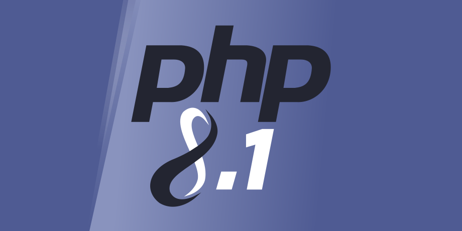

Вышел релиз Evolution CMS 1.4.18 от комьюнити.
## Что изменилось? ##
- Поддержка php 8.1
- исправлено восстановление неработающего пароля менеджера
- исправлено неправильное определение константы базового пути
## Как обновиться? ## 
- Найти в меню «Элементы» — «Плагины» — Updater
- Открыть плагин, перейти на вкладку «Конфигурация»
- Изменить параметр «Version» на значение `evocms-community/evolution`
- Сбросить кэш цмс («Инструменты» — «Очистить кэш»).

На главной странице админ-панели будет доступно обновление.

